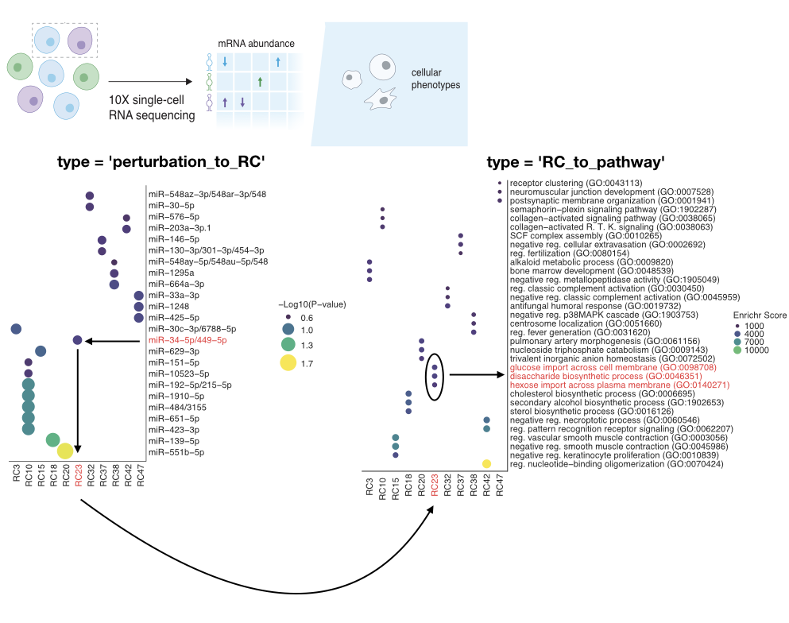

# VariPath

## Overview

This package identifies novel pathway shifts in scRNA-seq data using large shifts in 
varimax rotation component space of samples from a control. It creates a linear model
between your samples and the control to identify which rotated component most corresponds
to each sample allowing novel pathway discovery of perturbations. This package is orginally
tested on data with small RNA perturbations (miRNA and tRNA fragments) but is more broadly 
applicable to other perturbations where the effect on the transcriptome from a perturbation 
is being studied such as drug treatment or mRNA knockdown.

This package utilizes [enrichR](https://maayanlab.cloud/Enrichr/) on the 
backend for identifying pathways using gene set enrichment from genes with high 
weights in their respective perturbation-associated rotated component.

## Installation

- Install the latest version from
  [GitHub](https://github.com/ssobt/VariPath) as follows:

``` r
# Install
if(!require(devtools)) install.packages("devtools")
devtools::install_github("ssobt/VariPath")
```

Please make sure you have packages in the DESCRIPTION file installed, 
some may need manual installation via install.packages(), BiocManager::install(), 
or installation with conda if you are using a conda environment (recommended). 
If these do not automatically install and manual installation is required, use the following for VariPath: 

``` r
# Install
if(!require(devtools)) install.packages("devtools")
devtools::install_github("ssobt/VariPath", upgrade = "never", lib = "/VariPath_package_destination_folder/")
```

## Usage

Identify and plot pathway shifts associated with each perturbation

``` r
.libPaths("/VariPath_package_destination_folder/") ## add location of package to searchable library paths
library(VariPath)

# make sure single cell RNA-seq data is in a Seurat object with a specified metadata column with sample identity
## IMPORTANT: make sure the control sample is called 'TuD_NC' in your specified metadata column ##

out = sc_varipath(seurat_obj = adata.R, perturbation_column = 'miR.family')

## Plot ##

options(repr.plot.width = 20, repr.plot.height = 10) ## edit to change plot dimensions
plot_sc_varipath(sc_varipath_out = out, type = 'perturbation_to_RC')


plot_sc_varipath(sc_varipath_out = out, type = 'RC_to_pathway')
```

